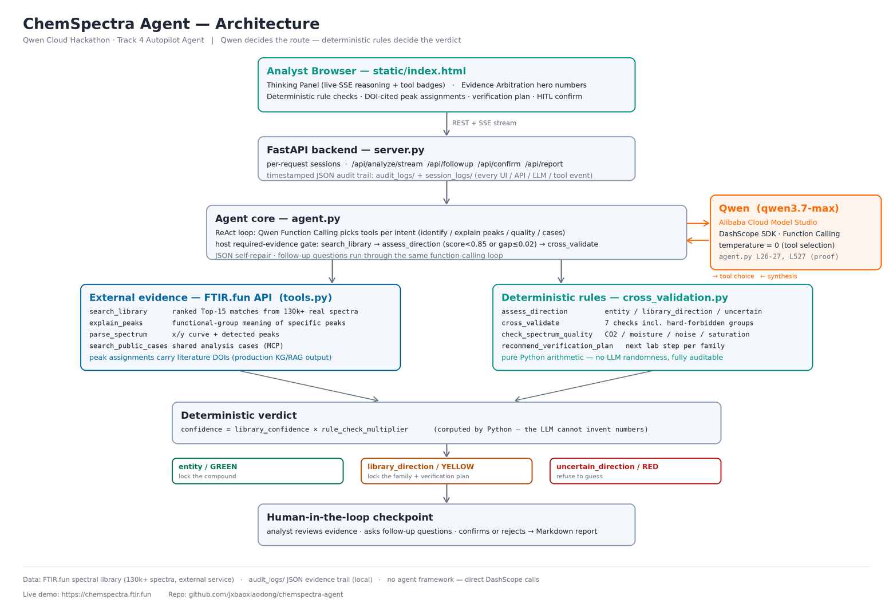

# ChemSpectra Agent

**An AI autopilot for FTIR spectral interpretation — Qwen Function Calling + deterministic evidence arbitration + human-in-the-loop.**

Built for the **Global AI Hackathon: Qwen Cloud** (Devpost), **Track 4 — Autopilot Agent**.

🔴 **Live demo:** https://chemspectra.ftir.fun

---

## The problem

Measuring an FTIR spectrum takes minutes. Interpreting it is the bottleneck. On hard samples, a spectral library returns a list of near-tied candidates — for example 15 candidates all scoring between 0.90 and 0.91. A ranked list like that does not answer the analyst's real questions: *what can I defensibly conclude, and what should I do next?*

A bare LLM cannot fix this: without real library evidence it hallucinates chemistry. A bare library cannot fix it either: it only sorts, it never decides.

## What the agent does

ChemSpectra Agent combines a real 130k-spectrum library, Qwen tool orchestration, and local deterministic rules to resolve every analysis to one of three defensible levels:

| Verdict | Meaning | What the analyst gets |
|---|---|---|
| `entity` / **GREEN** | Evidence is sufficient to act on the top candidate | Confirmation plan against a reference spectrum |
| `library_direction` / **YELLOW** | No single compound can be locked, but the **chemical family** can | The locked direction + a concrete lab plan to narrow it down (e.g. *nitrogen/elemental check or DSC to separate PS from ABS/SAN*) |
| `uncertain_direction` / **RED** | Candidates diverge | An honest refusal to guess + re-measurement guidance |

The key mechanic is the **level shift**: when near-tied candidates make a single-compound call indefensible (entity share ≈ 7%), the agent arbitrates at the material-direction level using deterministic arithmetic over the Top-15 evidence — and tells the human exactly which orthogonal measurement would settle the rest.

## Architecture



## Where Alibaba Cloud is used (proof)

The agent's reasoning runs on **Qwen (`qwen3.7-max`) via Alibaba Cloud Model Studio / DashScope**:

- [`agent.py#L26-L27`](agent.py#L26-L27) — `dashscope` SDK import
- [`agent.py#L531-L538`](agent.py#L531-L538) — `Generation.call(..., tools=AGENT_TOOLS, temperature=0)` — Qwen Function Calling selects the tools
- [`agent.py#L416-L425`](agent.py#L416-L425) — streamed synthesis with visible reasoning (`enable_thinking`)
- [`requirements.txt`](requirements.txt) — `dashscope>=1.20.0`

No agent framework is used — direct DashScope calls, easy to audit.

## The six tools Qwen routes between

| Tool | Type | Intent |
|---|---|---|
| `search_library` | FTIR.fun REST | "What material is this?" — ranked Top-15 matches from 130k+ real spectra |
| `explain_peaks` | FTIR.fun REST | "What does 1715 cm⁻¹ mean?" — a different intent, a different tool |
| `check_spectrum_quality` | REST + local rules | CO₂/moisture background, noise, saturation — the agent perceives input quality before committing |
| `assess_direction` | Local Python | Deterministic Top-N direction arbitration (the level-shift core) |
| `cross_validate` | Local Python | 7 chemistry-consistency checks, including hard-forbidden functional groups (negative evidence veto) |
| `search_public_cases` | FTIR.fun MCP | Prior shared analyses, on explicit request |

Follow-up questions go through the same function-calling loop: ask about a peak in the middle of a session and Qwen routes to `explain_peaks`, not another library search.

## The determinism contract

- `confidence = library_confidence × rule_check_multiplier` — computed by Python. The LLM is not allowed to invent numbers.
- Arbitration thresholds are named constants in [`cross_validation.py`](cross_validation.py) — no hidden model scores.
- Same spectrum → same verdict numbers, every run. The LLM's tool route may vary; the deterministic verdict does not.
- Every UI action, API call, LLM request/response, and tool result is written to a timestamped JSON audit trail.
- Peak assignments returned by the library carry **literature DOIs** (the production knowledge-graph output), so every band assignment is traceable to a source.

## Human-in-the-loop

Lab decisions in pharma, forensics, and QC cannot be fully automated — and should not be. The pipeline always pauses at a confirmation checkpoint: the analyst reviews the arbitration evidence, challenges the agent with follow-up questions, and only then is the report generated.

## Demo samples

Real spectra from the FTIR.fun platform are included in [`samples/`](samples/):

| File | Material | Verified verdict (this code, live API) |
|---|---|---|
| `20260212214838789416377.dx` | Styrenic polymer | `entity` / **GREEN** — Top-1 0.9137, entity share 6.9%, direction confidence 100% |
| `20260707120623668587.csv` | Vegetable oil (fatty esters) | `library_direction` / **YELLOW** — Top-1 0.8182 with a 0.0055 gap, entity share 6.9%, ester-family direction 66.6% (10/15 candidates), verification plan generated |
| `20260620134005173506225.csv` | Unknown mixture | `uncertain_direction` / **RED** — Top-1 0.8029, direction confidence 36.4%, the agent refuses to guess |
| `gelatin.csv` | Protein biopolymer | try it — protein-family candidates dominate the list |
| `polypropylene.csv` | Polyolefin | try it — a noisy candidate tail dilutes the direction share |

Together the first three cover all three verdict levels of the arbitration engine — GREEN, YELLOW and RED — on real data. The RED case is also the reproducibility fixture: three consecutive runs return the identical verdict numbers (score 0.8029, confidence 0.6423).

## Run it locally

```bash
pip install -r requirements.txt

export DASHSCOPE_API_KEY="sk-..."   # Alibaba Cloud Model Studio: https://modelstudio.console.alibabacloud.com/
export QWEN_MODEL="qwen3.7-max"
export FTIRFUN_API_KEY="..."        # FTIR.fun spectral backend API key
export FTIRFUN_API_URL="https://ftir.fun"

PORT=8080 python3 server.py
# open http://127.0.0.1:8080
```

- A DashScope key is free to create in Alibaba Cloud Model Studio.
- The spectral backend is the production **FTIR.fun** API, which requires an API key. Judges can use the live demo above — it runs this exact code against the real library — and the demo video shows the full flow end-to-end.

## Built on a real platform

FTIR.fun is a production spectral platform: 130,000+ measured spectra, 20+ file formats, users in 50+ countries, real paid analyses. The agent layer in this repository was written for the hackathon; production code is not imported — the deterministic rules are compact reimplementations of production reasoning ideas, and the platform serves as the evidence source through its public API.

ChemSpectra Agent does not replace spectroscopists. It takes the ambiguity out of the routine, exposes uncertainty honestly, and hands the final decision back to the expert.

## License

[MIT](LICENSE)
